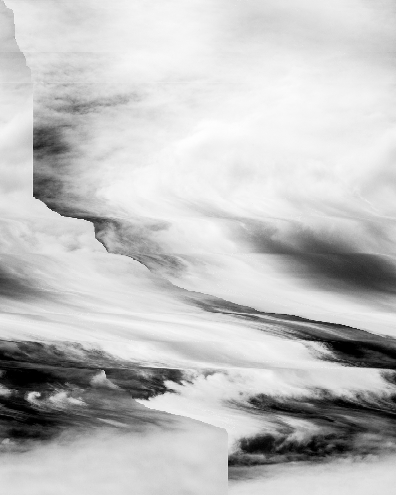

项目网站、社交联系方式、项目介绍内容详见：https://opensea.io/collection/cloud-by-barry-stone

Assembly 展示了 Barry Stone 的*/CLOUD/*，该项目的灵感来自 Alfred Steiglitz 的“Equivalents”，这是一系列 1922-30 年间的标志性云研究。施蒂格利茨的作品并非意在描绘云的物质本质，而是表达了艺术家内心的情感状态。Steiglitz 100 年后，斯通的照片是用数码相机拍摄的，并通过程序员使用的十六进制编辑器重新排列代码来进行操作。由此产生的机会操作为每个云创建了一个新版本，并使用其自己的数字“材料”进行了更改。在自然界中看到的云是高度可变的短暂结构，由我们的想象力塑造和激活。这里展示的每张照片都延续了这个无限可能的循环，向每个观众带给主题的意义敞开了大门。

