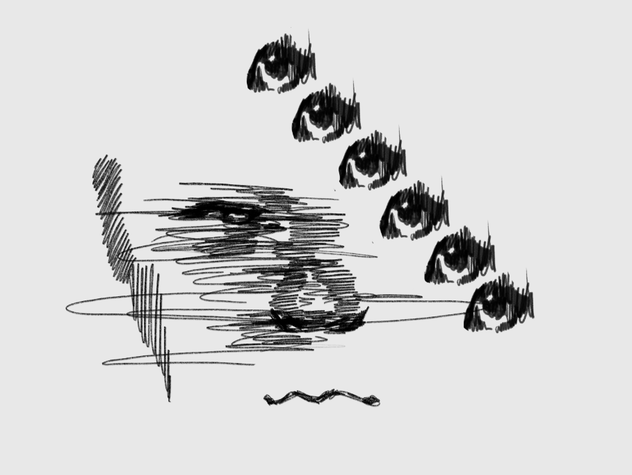

项目网站、社交联系方式、项目介绍内容详见：https://opensea.io/collection/club021

CLUB 021（从零到一）是一个创造 NFT 艺术趋势 [-ism] 的项目

将艺术家、工程师和收藏家聚集在一起，不分国籍、出身、性别和流派。

使用智能合约，去中心化的艺术家社区 [CLUB 021] 将创造一个无论媒体、超越时空的新浪潮。

如果您想分享下一代艺术形式诞生的时刻，请加入CLUB 021社区。

