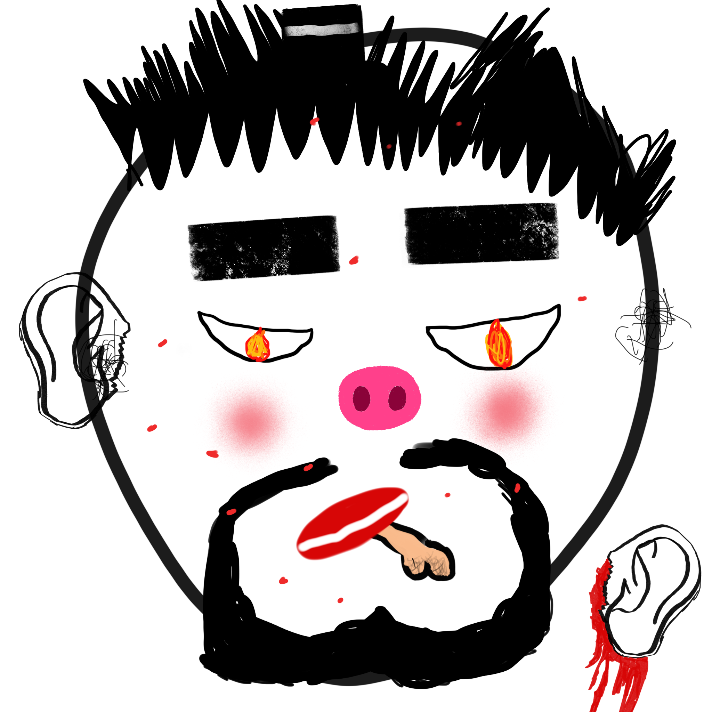

项目网站、社交联系方式、项目介绍内容详见：https://opensea.io/collection/clusterfucks

CLUSTERFUCKS 是当代艺术的自我贬低作品，它嘲弄失控的 PFP 文化。

更酷的特征更常见。他妈的稀有，相信你自己的口味，玩得开心。

如果这不是我，我知道谁是记住，你不能审查艺术。

我是我最喜欢的艺术家 • FND • Manifold • Opensea • Objkt • KO

