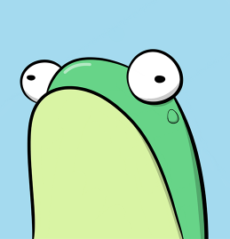
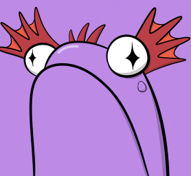
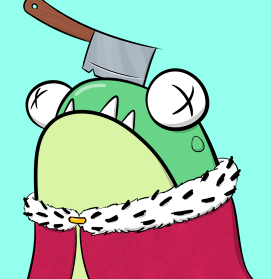

项目网站、社交联系方式、项目介绍内容详见：https://opensea.io/collection/fly-frogs

 Fly Frogs 是 10,000 个随机生成的 NFT 的集合。我们的池塘没有底（只有泥）和一个跳跃的、积极的社区。与我们的艺术家一起观看现场绘画课程并参加涂鸦比赛——这是一种民主！

要繁殖蝌蚪，您需要持有两只青蛙和两只苍蝇。每只青蛙都可以繁殖任意多次。每只蝌蚪的成本是 2 只苍蝇 + 汽油。如果您在美国东部标准时间 10 月 28 日晚上 10 点持有 Frog，您将通过空投收到 Flies。需要更多苍蝇吗？[在OpenSea](https://opensea.io/assets/matic/0x944de29a2ea9bebdb26b8a387afbf95a364a37cc/0)上购买一些。

