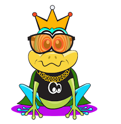
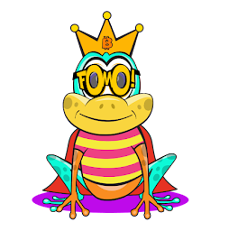

项目网站、社交联系方式、项目介绍内容详见：https://opensea.io/collection/fomo-frogs

 

 ▶ 什么是 FomoFrogs？

FomoFrogs 是一个 NFT（非同质代币）集合。存储在区块链上的数字艺术品集合。

##### ▶ 有多少 FomoFrogs 代币？

总共有 213 个 FomoFrogs NFT。目前，20 位所有者的钱包中至少有一个 FomoFrogs NTF。

##### ▶ 最近卖出了多少只 FomoFrog？

过去 30 天内售出 0 个 FomoFrogs NFT。

