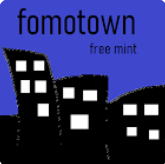
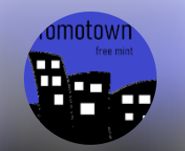
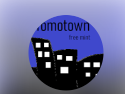

项目网站、社交联系方式、项目介绍内容详见：https://opensea.io/collection/fomotown

##### ▶ 什么是 FOMOTown？

FOMOTown 是一个 NFT（非同质化代币）集合。存储在区块链上的数字艺术品集合。

##### ▶ FOMOTown 代币有多少？

总共有 1,337 个 FOMOWown NFT。目前 146 位所有者的钱包中至少有一个 FOMOWown NTF。

##### ▶ FOMOTown 最近卖了多少？

过去 30 天内共售出 0 份 FOMOTown NFT。

