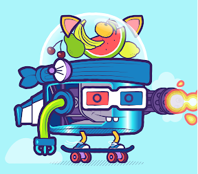

项目网站、社交联系方式、项目介绍内容详见：https://opensea.io/collection/foodbots-official

Foodbots 起源：在 Foddietown 的大学校园里，研究人员渴望开发出第一个能够用密码制作食物的厨房机器人，但是当机器人、密码和甜甜圈接触时出现了问题。在一次量子爆炸中，一个头戴水肺潜水服的小生物似乎有一个用于大脑的甜甜圈。第一个 FoodBot 已经诞生。

FoodBots 只能吃产生它们的食物，如果它们吃其他种类的食物，它们会呕吐出来，然后从呕吐物中出现一个新的 FoodBot，其大脑来自呕吐的食物。

他们没有腿，没有手臂，没有尾巴，他们获得环境中的元素是因为他们希望看起来像人类。

​                                                   

