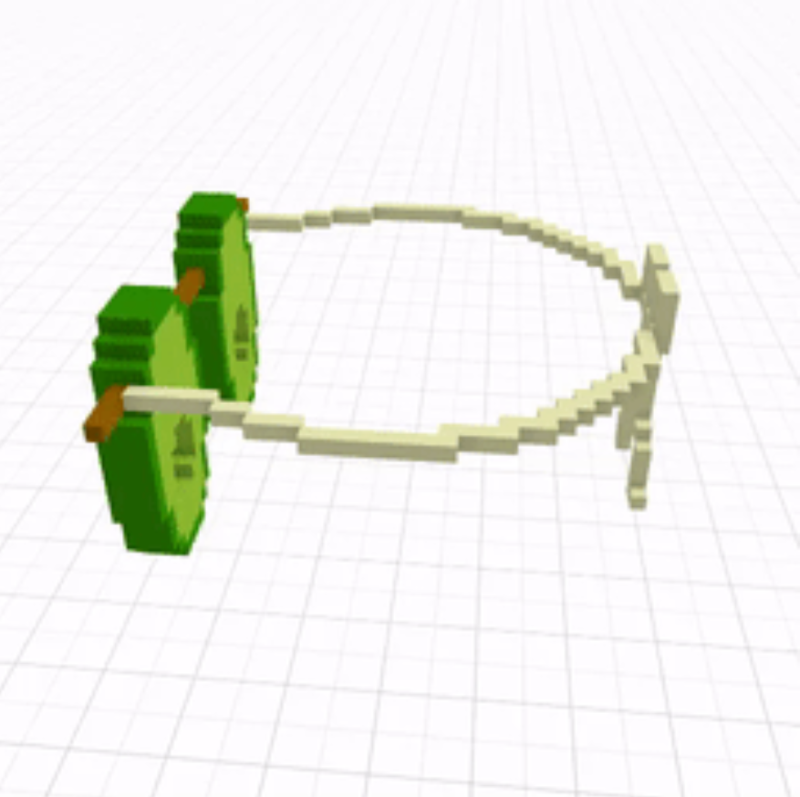
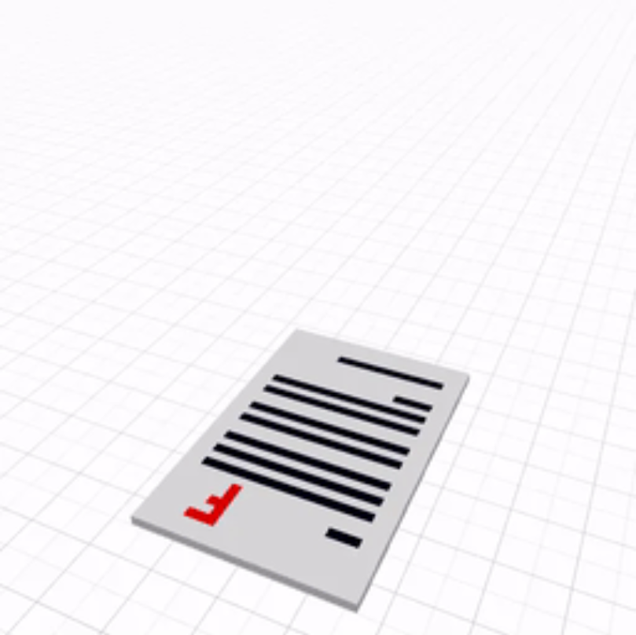

项目网站、社交联系方式、项目介绍内容详见：https://opensea.io/collection/foodmasku-library

▶ 什么是 Foodmasku 图书馆？
Foodmasku Library 是一个 NFT（非同质代币）集合。存储在区块链上的数字艺术品集合。
▶ 有多少 Foodmasku Library 代币？
总共有 4 个 Foodmasku Library NFT。目前，1,357 名业主的钱包中至少有一个 Foodmasku Library NTF。
▶ 最近卖出了多少 Foodmasku Library？
在过去 30 天内售出了 0 个 Foodmasku Library NFT。

