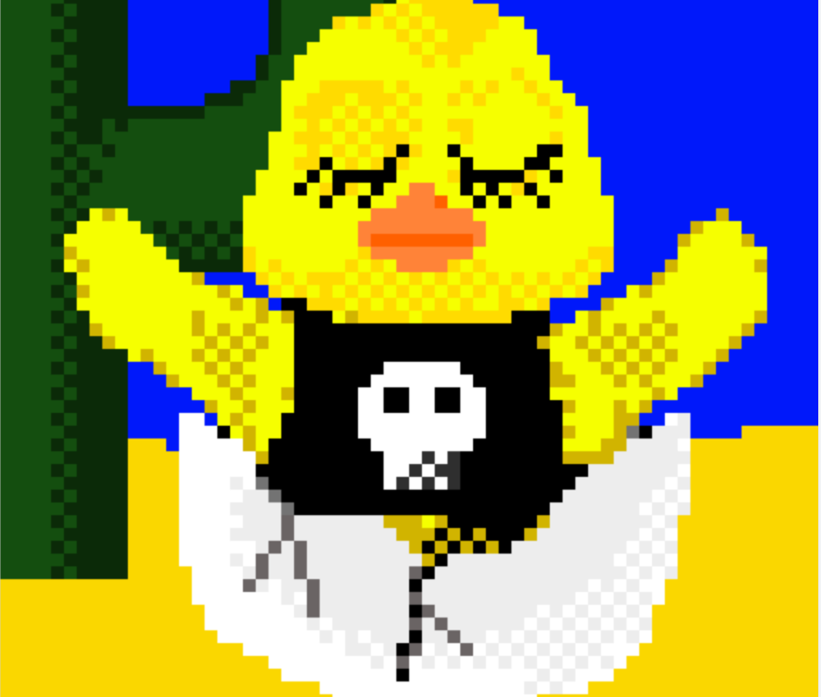

▶ 什么是 2021 年养鸡场孵化？
养鸡场孵化 2021 是一个 NFT（不可替代代币）系列。存储在区块链上的数字艺术品集合。
▶ 有多少种养鸡场孵化 2021 代币？
总共有 1,515 个养鸡场孵化 2021 NFT。目前，572 位业主的钱包中至少有一个养鸡场孵化 2021 NTF。
▶ 2021 年养鸡场孵化最近卖出了多少只？
过去 30 天内售出 0 个 Chicken Farm Hatching 2021 NFT。

