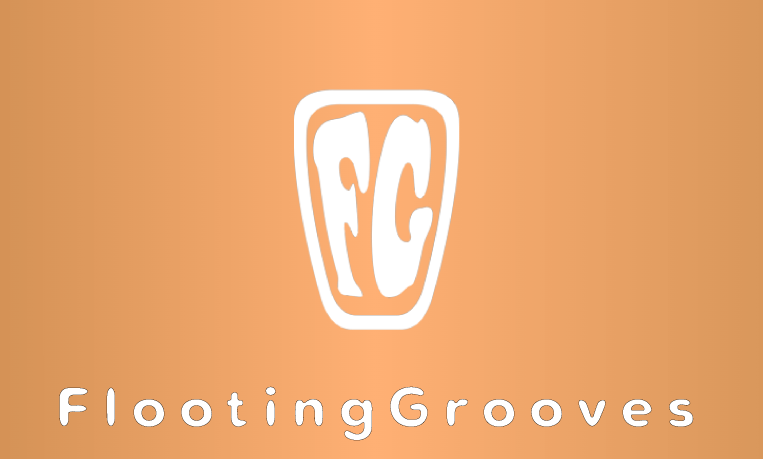

**FLOOTING GROOVES**是 Pearce van der Merwe 的独奏项目 - 一位音乐家/制作人，他喜欢将长笛和其他乐器与酷炫的电子效果相结合，从而产生愉快的感觉和更深层次的意识状态。

他于 1975 年出生于开普敦，在南非和意大利长大，周围环绕着音乐。在年轻时尝试过各种乐器，包括小提琴、钢琴和圆号后，他最终选择了银长笛，深受与 Jethro Tull 相遇的影响。他早期的接触范围从古典到爵士、摇滚和相关风格。像 Ozric Tentacles 和 Pink Floyd 这样的团体让他了解了 Psychedelia，这就是他的旅程开始的地方。

