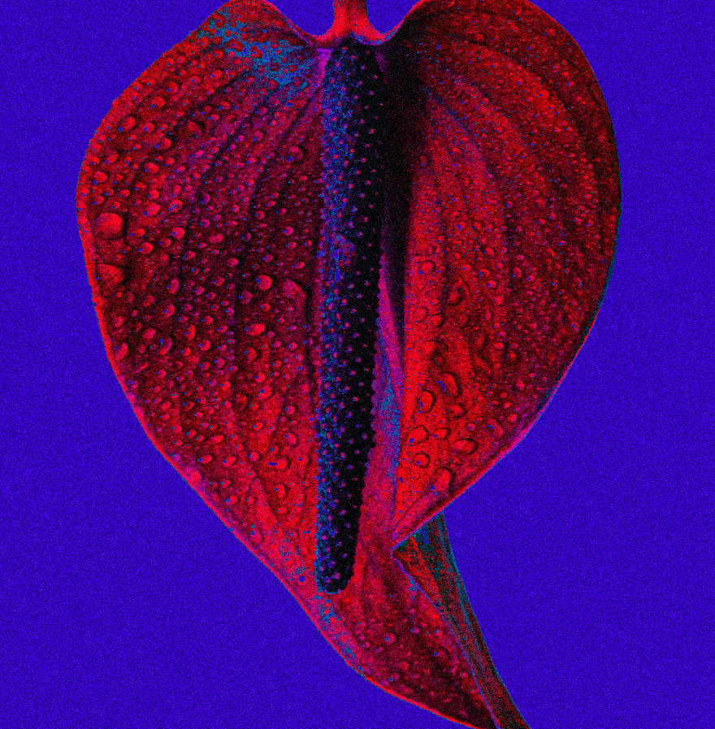

作品涵盖时尚摄影、艺术、电影、音乐和创意方向。斯宾塞的起源始于对音乐和戏剧的古典训练，通过摄影媒介进行实验，记录他周围世界的风格和怪癖。他的作品极具视觉性、趣味性和流行性。

每朵花都是通过一系列过程创造出来的——从在工作室或大自然中拍摄的实物照片开始，然后将它们传输到计算机中，有时又回来再输入。每个人都给予了混合媒介治疗和奉献的时刻。

Flower Farm 由 Toy Factory 制作和策划

Byron Spencer 的 Flower Farm 是一个 NFT（不可替代代币）系列。存储在区块链上的数字艺术品集合。共有 666 个花卉农场。目前，212 位业主的钱包中至少有一个 Byron Spencer NTF 的 Flower Farm。

