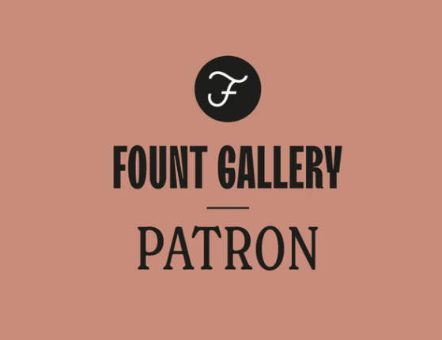
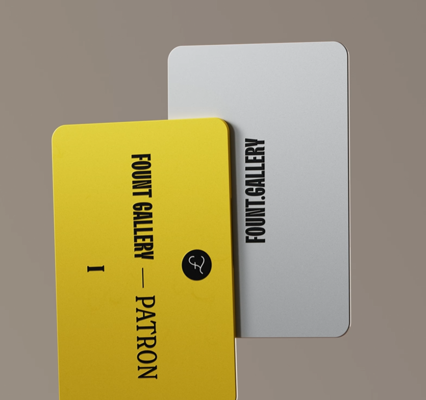

项目网站、社交联系方式、项目介绍内容详见：https://opensea.io/collection/fount-card

作为 Fount Gallery 的赞助人，通过早期访问发现新艺术。

Fount Gallery 顾客可以期待我们画廊生态系统中具有最高质量和长期实用性的多个收藏品。

赞助人 I 卡的好处：

•预售访问和许可名额的独家持有人抽奖活动（根据每个项目确定供应）

 使用 FGPI 角色分配访问私人不和谐频道

•惊喜惊喜

