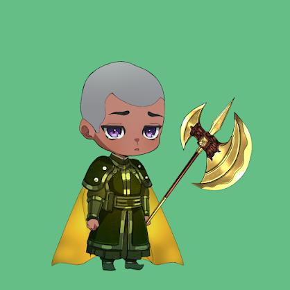
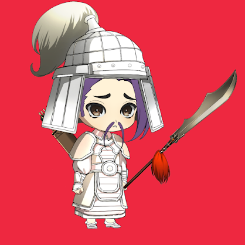
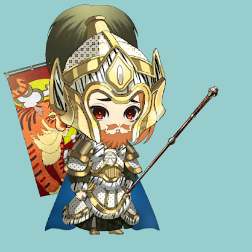

项目网站、社交联系方式、项目介绍内容详见：https://opensea.io/collection/clash-warriors

Honor Of The Clash Warriors ( **ClashWarriors** ) 是一个以游戏赚钱的 NFT 游戏世界，拥有传奇战士的创世系列。

##### ▶ 什么是冲突勇士的荣誉？

Honor Of The Clash Warriors 是一个 NFT（不可替代代币）系列。存储在区块链上的数字艺术品集合。

##### ▶ 冲突勇士的荣誉代币有多少？

总共有 2,287 个 Honour Of The Clash Warriors NFT。目前，432 位车主的钱包中至少有一本 Honor Of The Clash Warriors NTF。

