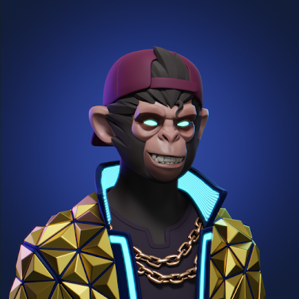
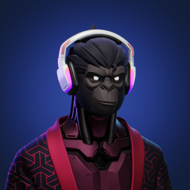

项目网站、社交联系方式、项目介绍内容详见：https://opensea.io/collection/clone-apes-the-collection

欢迎来到克隆猿薄荷  他们来了：“克隆猿”。善意的建议：不要惹我们的机器人猿。这些在生物学和技术上经过优化的类人猿将在这里接管。

Clone Apes 是一款出色且绝对独特的下一代类人猿 3D 合集。不要错过机会，成为未来和我们家庭的一部分。

