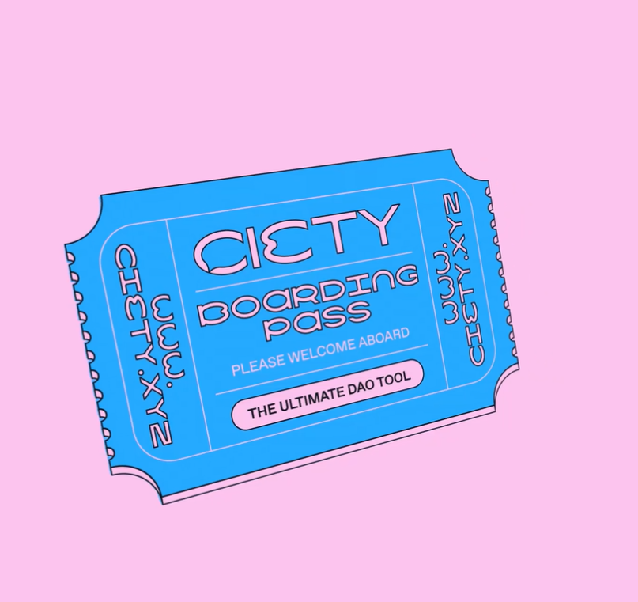
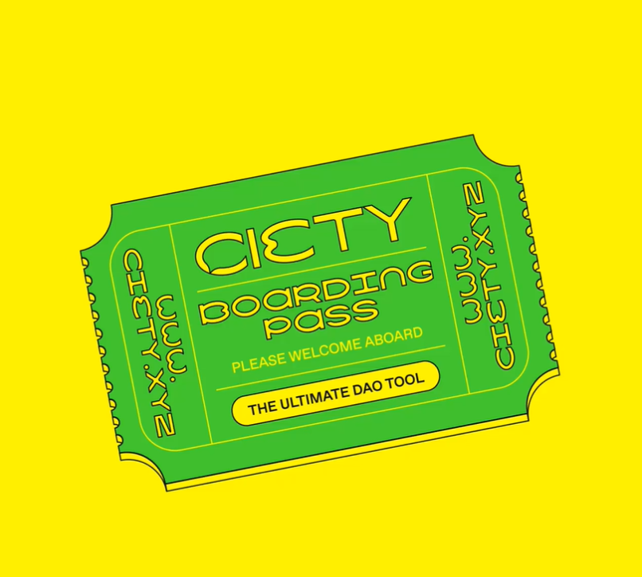
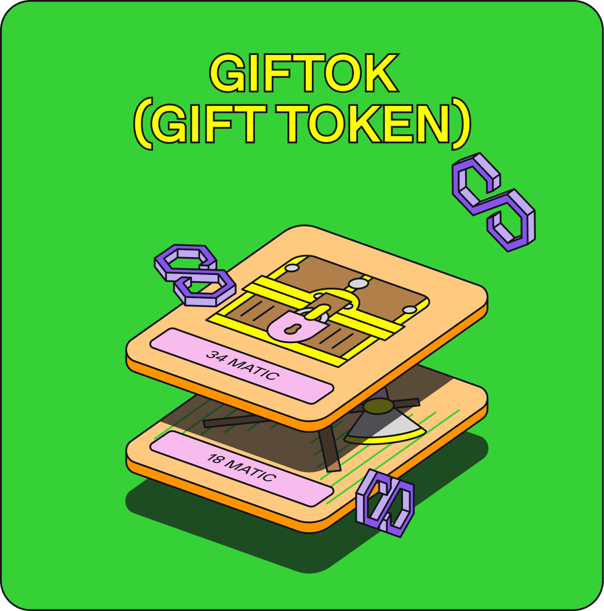

项目网站、社交联系方式、项目介绍内容详见：https://opensea.io/collection/ciety-friends

在CIETY.上，持有者完全沉浸在社区中，自己拥有PFP。在CIETY上，您可以发布和回复文本、照片、视频和NFT。开始一一个新线程，享受会员之间的实时消息。

根据用户的NFT持有量控制对社区独家内容的访问。分析通过钱包认证的成员的链上/链下贡献，并通过简单的UI奖励他们。与社区成员合作，为实现集体目标巩固项目。决策由提案和投票决定，这导致了高度的参与和参与。

