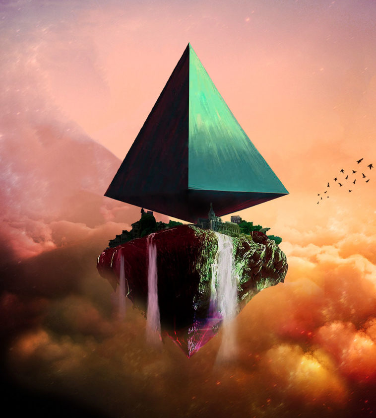
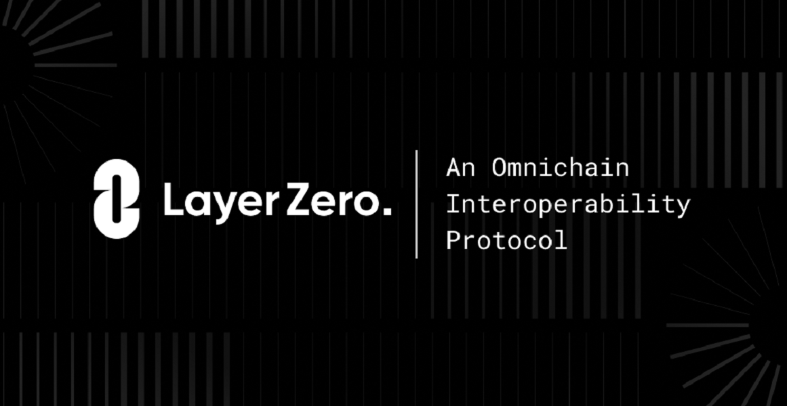

项目网站、社交联系方式、项目介绍内容详见：https://opensea.io/collection/citeriumland

您可以在 Citerium 中创建自己的头像、工作场所、家庭、车辆。超过 30 种交易方式和无限的娱乐选择！CTE 代币是 Citerium 的主要管理代币和官方货币。用于土地、NFT、化妆品和头像。CTE 持有者之间可以进行交易。您可以使用 Metamask、Coinbase Wallet、Trust Wallet、WalletConnect 访问 Meta Field。（快来了）我们计划在主网的最后准备工作和 NFT 上市后的 1 个月内开始销售。

