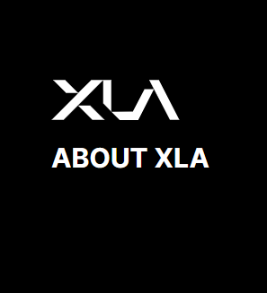
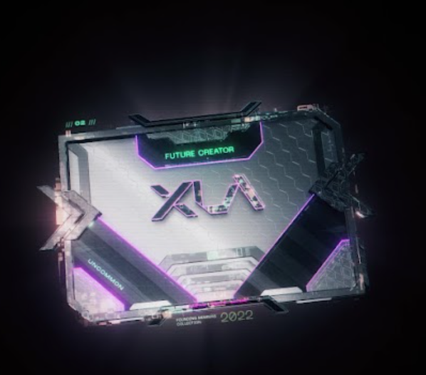
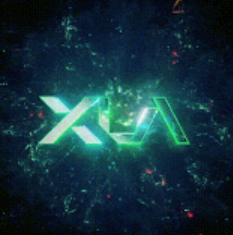

项目网站、社交联系方式、项目介绍内容详见：https://opensea.io/collection/founding-members

我们的使命是使知识产权创造者、所有者和持有者的财富积累和收入分配民主化。

X.LA 团队由视频游戏和娱乐行业的专业人士组成，他们在全球范围内提供价值数十亿美元的游戏、电影、音乐和产品（硬件和软件）方面有着良好的记录。

Aleksandr “Shurick” Agapitov 是价值数十亿美元的企业 Xsolla 的创始人，该企业是全球领先的金融科技业务和游戏微交易引擎。X.LA 基金会于 2022 年 2 月与联合创始人 Dmitri Bourkovski 和 Constantin Andryushchenko 共同创立，他们是 Xsolla 的前高管，旨在确保 Web3 的承诺和潜力触手可及。

