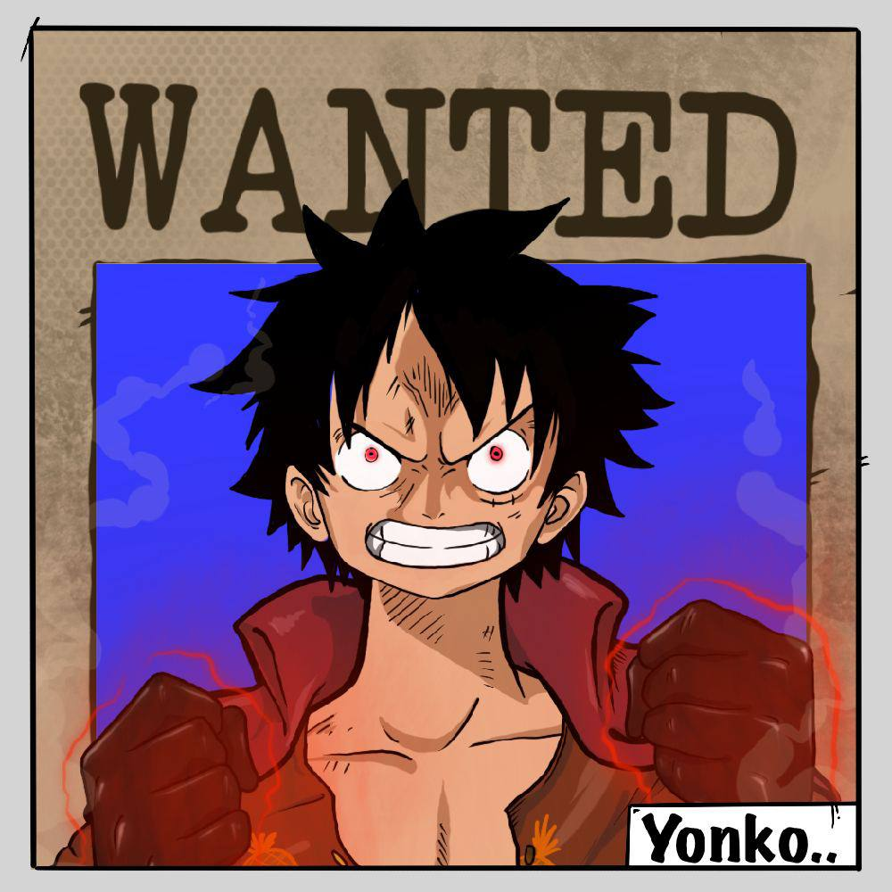
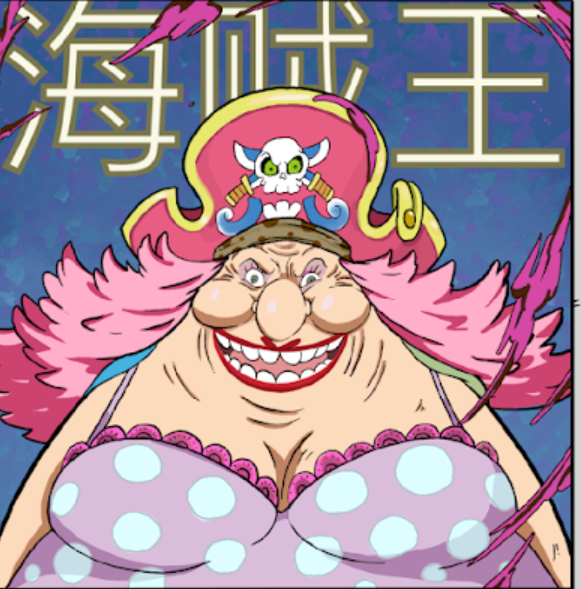
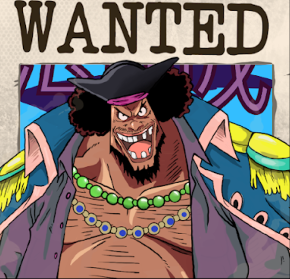

项目网站、社交联系方式、项目介绍内容详见：https://opensea.io/collection/four-emperors-nft-collection

Yonko 被要求达到其他人失败的水平。动漫代币开发者做出了大量空洞的承诺，这就是人们不信任整个 DeFi 空间的原因。在经验丰富的开发人员和鲸鱼的支持下，Yonko 可以修复它。

$YONKO 是一个旨在颠覆动漫行业的 NFT 协议。$YONKO 通过游戏化和重新利用广受欢迎的日本游戏，帮助艺术家通过区块链上的可收藏 NFT 将他们的艺术品货币化。

