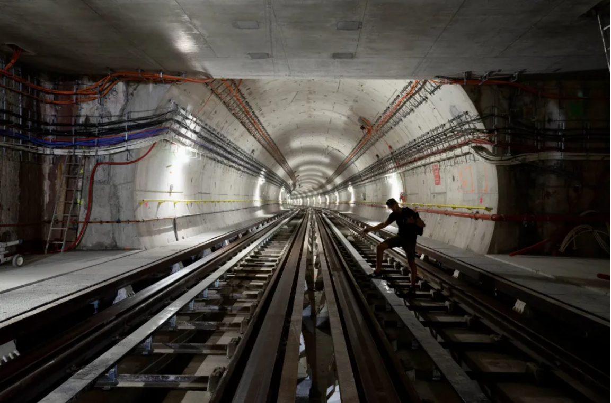

项目网站、社交联系方式、项目介绍内容详见：https://opensea.io/collection/cities-top-to-bottom

▶ 什么是城市：从上到下？
Cities: Top to Bottom 是一个 NFT（不可替代代币）集合。存储在区块链上的数字艺术品集合。
▶ 有多少个城市：自上而下的代币存在？
总共有 10 个城市：从上到下的 NFT。目前 7 位所有者的钱包中至少有一个 Cities: Top to Bottom NTF。
▶ 最近卖出了多少个城市：从上到下？
过去 30 天内售出 0 个城市：自上而下的 NFT。

