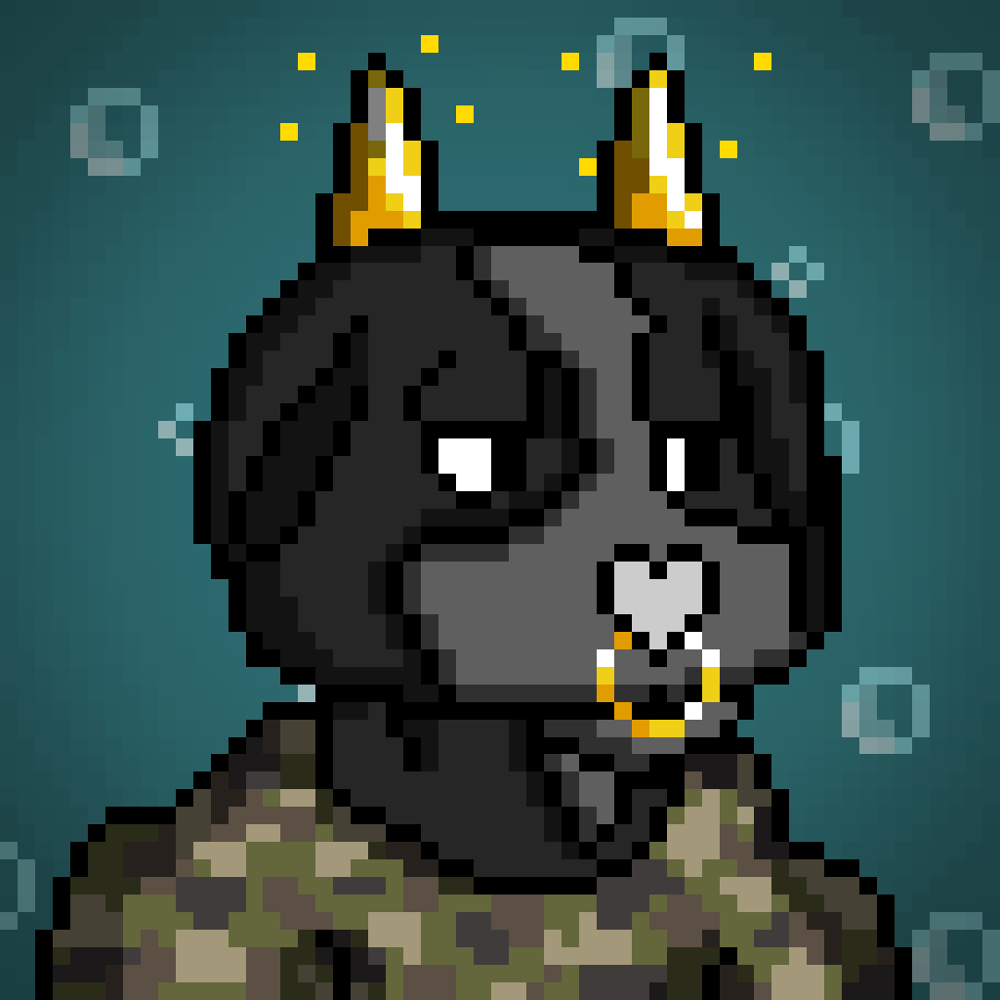
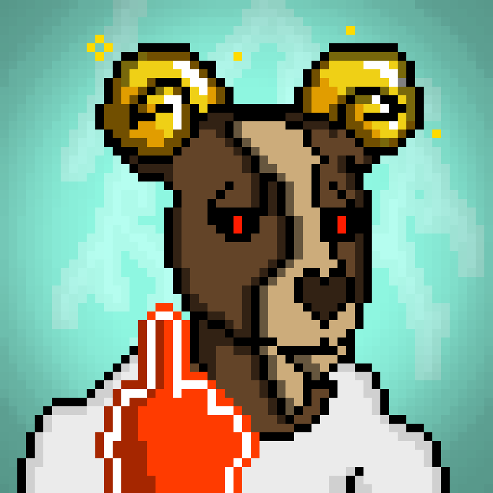

项目网站、社交联系方式、项目介绍内容详见：https://opensea.io/collection/chonkygoats

我们将再免费获得 500 次我的宠物山羊进入房间时不小心又获得了 500 次免费哦

 ▶ 什么是 chonkygoats？

chonkygoats 是一个 NFT（非同质代币）集合。存储在区块链上的数字艺术品集合。

##### ▶ 有多少个 chonkygoats 代币？

总共有 1,895 个 chonkygoats NFT。目前，301 位所有者的钱包中至少有一个 chonkygoats NTF。

##### ▶ 最近卖出了几只小山羊？

过去 30 天内售出 0 个 chonkygoats NFT。

