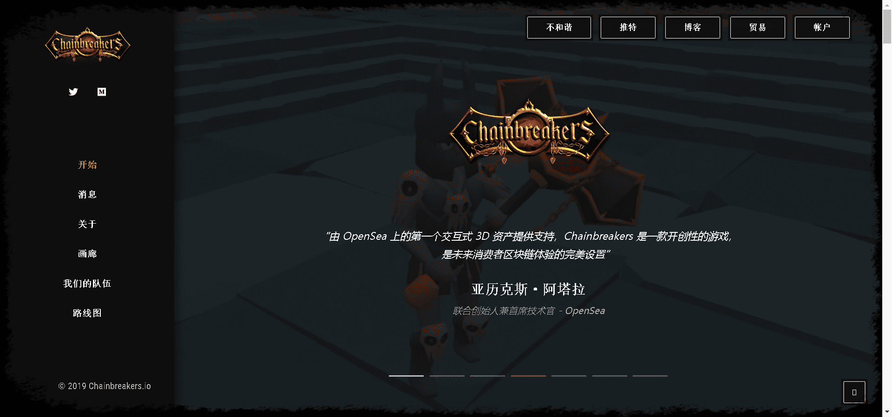

以太坊上发布的第一个 3D 资产！这个区块链游戏特许经营权使玩家能够将游戏时间和进度货币化。第一个 Chainbreakers 游戏是一款以古希腊为背景的策略角色扮演游戏，专门在 Decentraland 推出。这些物品也用于已经宣布的第二个标题。

Chainbreakers 是一款策略角色扮演游戏，通过设计整合了加密货币和数字稀缺游戏资产。玩家通过积极玩游戏和战略性地开发他们的资产来获得 MANA 奖励。虽然后端在以太坊区块链上运行并在 Solidity 智能合约中编程，但游戏虚拟现实前端将从 Decentraland 元节访问。

