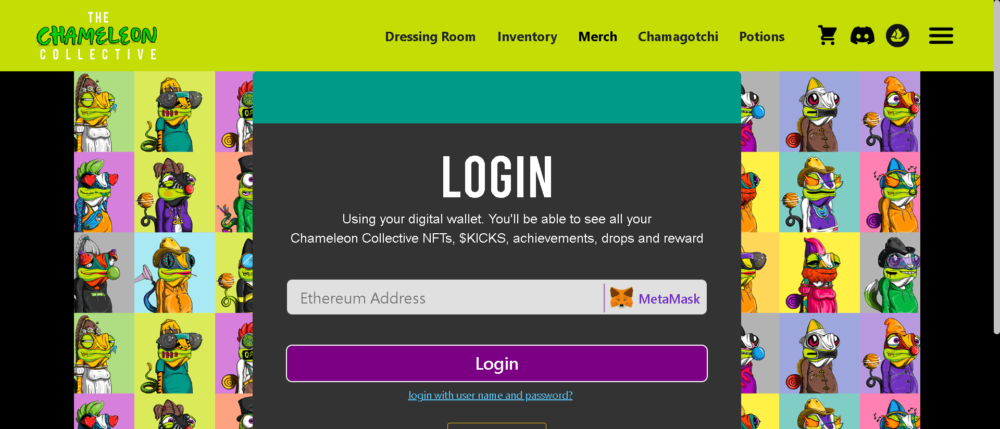

当前集合大小 9600。最初有 700 个特征，现在有超过 1250 个不同的特征和颜色可供选择。

最初 10k PFP 系列已于 2021 年 11 月 7 日售罄

扎克·布什的原创艺术品。

Chameleon 集体拥有 NFT 空间内最强大的社区之一，所有这些社区都是由一个充满爱心的团队有机开发的。以增长为重点，预计未来将进一步更新原始集合并继续关注技术开发，以进一步扩大整体 NFT 空间并为持有者提供价值。

不要只为精美的创意和有趣的艺术设计而来，而是为体验而来。欢迎来到湛家。

