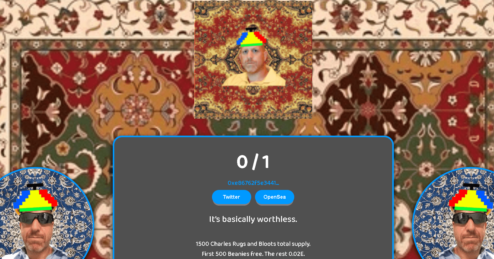

1500个查尔斯地毯和布洛特总供应量

▶ 什么是 Charles Bloot 地毯？
Charles Bloot Rugs 是一个 NFT（不可替代代币）系列。存储在区块链上的数字艺术品集合。

▶ 有多少个 Charles Bloot Rugs 代币？
总共有 579 个 Charles Bloot Rugs NFT。目前，125 位业主的钱包中至少有一个 Charles Bloot Rugs NTF。

