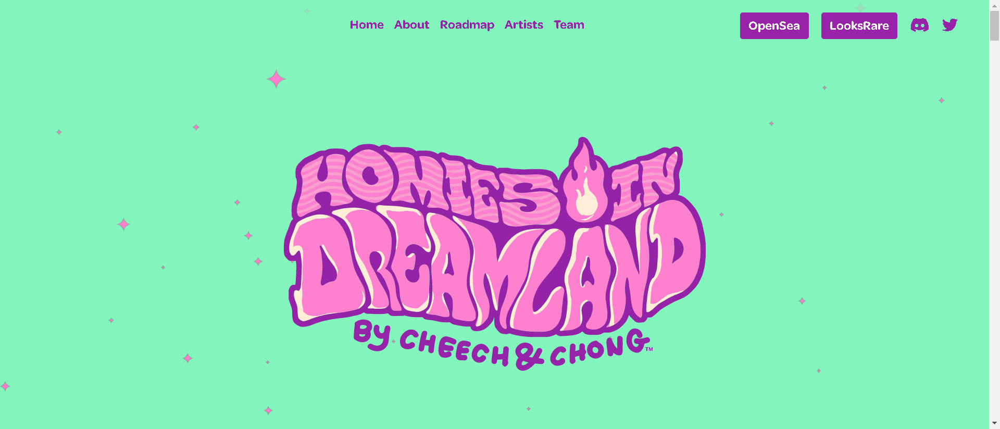

该系列致力于为 Cheech and Chong™ 创作的海报艺术

有关我的 Cheech 和 Chong NFT 的相关信息，请访问 MyHomies.com 或 MyHomies.com/discord 上的不和谐社区

10,420 个 Homies 将作为 ERC-721 代币存储在以太坊区块链上
每个 NFT 将花费 .1420 ETH
每笔交易的最大购买数量为 5
没有与定价相关的层级或联合曲线
元数据和图像将托管在 IPFS 上

