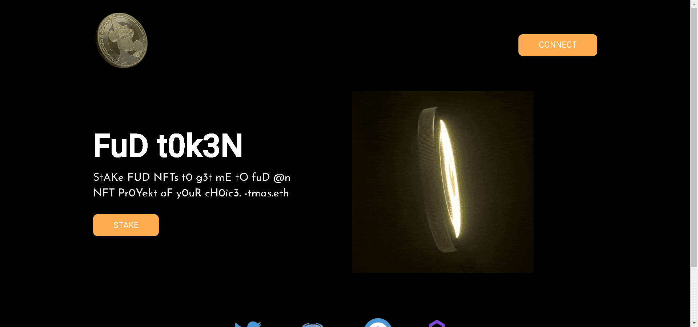

FUD 代币作为在 NFT 空间中引入透明协调的 FUDing。

▶ 什么是 FudToken？
FudToken 是一个 NFT（Non-fungible token）集合。存储在区块链上的数字艺术品集合。

▶ FudToken 有多少个？
总共有 1 个 FudToken NFT。目前 1,652 位所有者的钱包中至少有一个 FudToken NTF。

▶ 最昂贵的 FudToken 销售是什么？
出售的最昂贵的 FudToken NFT 是 FUD。它于 2022-06-11（3 个月前）以 2.4 美元的价格售出。

