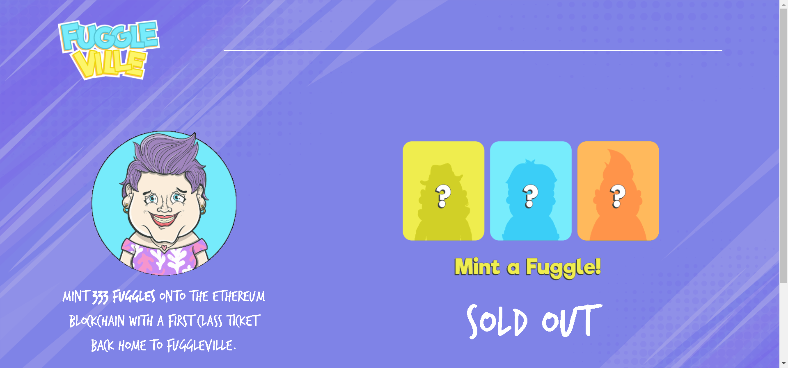

FuggleVille 美丽宇宙中的 333 位活泼的居民。

Mint 333 Fuggles使用返回 FuggleVille 的头等舱票进入以太坊区块链。

▶ 什么是 FuggleVille？
FuggleVille 是一个 NFT（不可替代代币）集合。存储在区块链上的数字艺术品集合。

▶ 有多少个 Fungles Assets 代币？
总共有 333 个 FuggleVille NFT。目前，219 位所有者的钱包中至少有一个 FuggleVille NTF。

