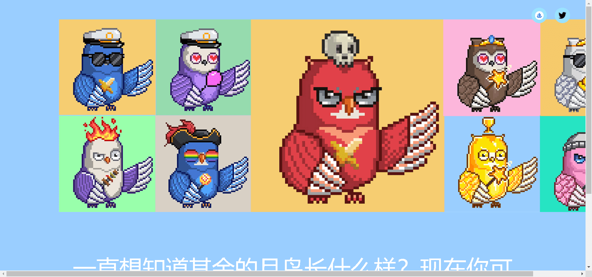

一直想知道其余的月鸟长什么样？现在你可以！Full Moonbirds 可让您铸造全身 Moonbirds！

▶ 什么是满月鸟？
Full Moonbirds 是一个 NFT（非同质代币）集合。存储在区块链上的数字艺术品集合。

▶ 有多少满月鸟代币？
总共有 2,461 个 Full Moonbirds NFT。目前，720 位车主的钱包中至少有一只 Full Moonbirds NTF。

