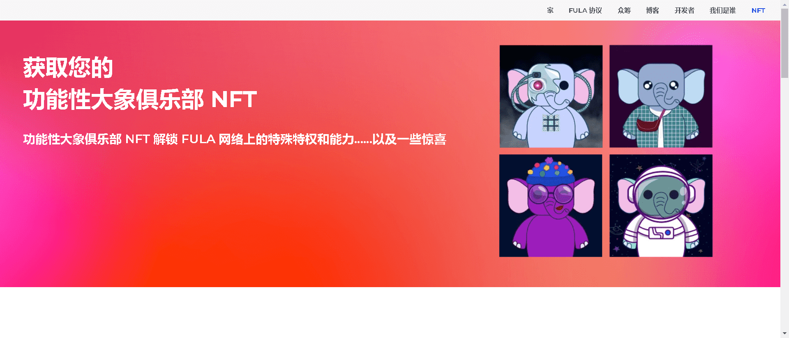

收集您的大象，开启一段激动人心的Fula 网络之旅，并解锁 Fula 网络的特殊福利。

功能性大象俱乐部是 1000 头独特的大象（500 头到 FULA 社区，500 头保留）在 Polygon 区块链上社交的集合。每头大象都是独一无二的，对你百分百忠诚；它不能被复制、带走或销毁。您的 Functional Elephant NFT 数据经久耐用。所有元数据都托管并固定在具有唯一 CID 的 IPFS 分布式网络上。

