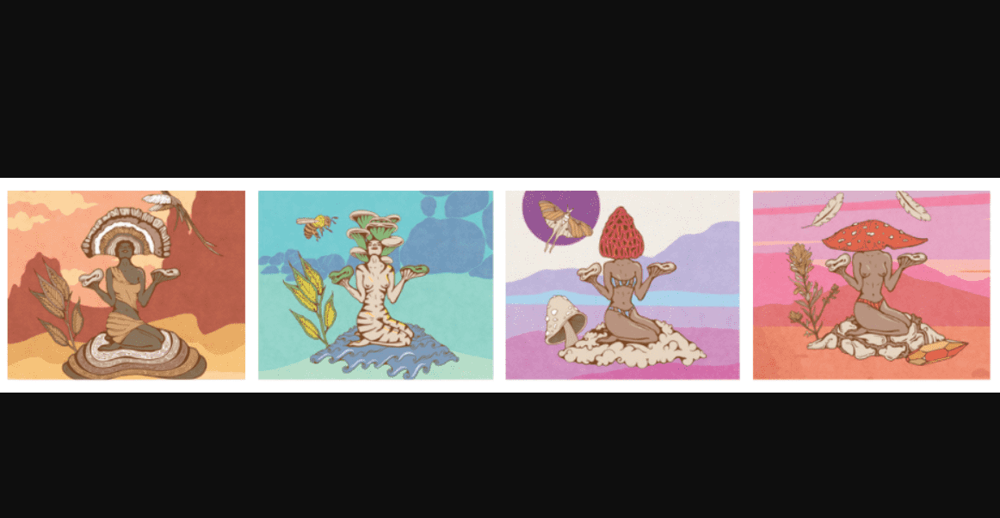

Fungi Queendom 是由艺术家 Lexie Baker 创建的一个生成式 NFT 项目，该项目在一个独特的插图集中捕捉蘑菇、女性表达、自然和神秘主义的精髓，为一位独一无二的艺术家。

▶ 什么是真菌王国？
Fungi Queendom 是一个 NFT（非同质代币）集合。存储在区块链上的数字艺术品集合。

▶ 有多少个 Fungi Queendom 代币？
总共有 260 个 Fungi Queendom NFT。目前，139 位所有者的钱包中至少有一个 Fungi Queendom NTF。

▶ 最昂贵的 Fungi Queendom 销售是什么？
售出的最昂贵的 Fungi Queendom NFT 是 Fungi Queendom #225。它于 2022-06-23（2 个月前）以 76.8 美元的价格售出。

