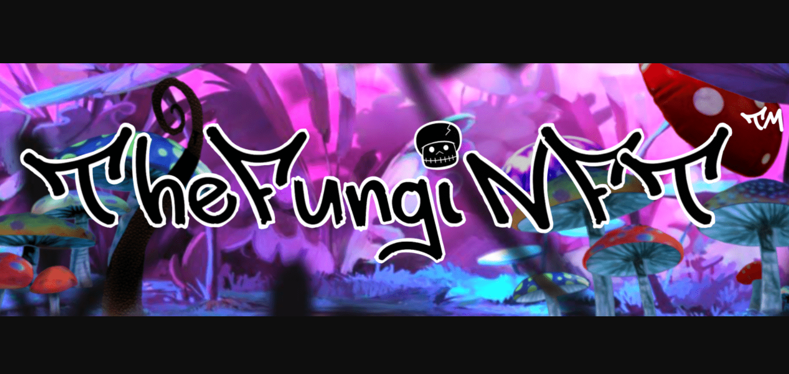

TheFungiNFT 是一个基于以太坊的 NFT 项目，最大供应量为 10,000 个代币，其雄心勃勃的目标是支持迷幻研究和心理健康。

▶ 什么是 FungiNFT？
FungiNFT 是一个 NFT（不可替代代币）集合。存储在区块链上的数字艺术品集合。

▶ FungiNFT 代币有多少？
总共有 315 个 FungiNFT NFT。目前，109 位所有者的钱包中至少有一个 FungiNFT NTF。

