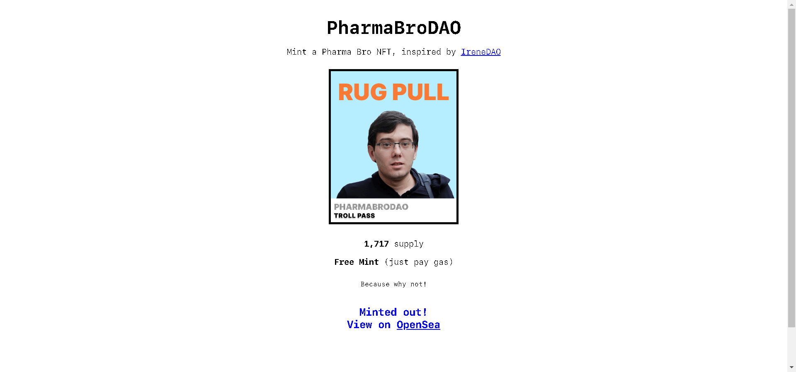

庆祝 Martin Shkreli 追求成功的旅程。

▶ 什么是 PharmaBroDAO？
PharmaBroDAO 是一个 NFT（非同质代币）集合。存储在区块链上的数字艺术品集合。

▶ PharmaBroDAO 代币有多少？
总共有 1,717 个 PharmaBroDAO NFT。目前，587 位所有者的钱包中至少有一个 PharmaBroDAO NTF。

▶ 最昂贵的 PharmaBroDAO 销售是什么？
最昂贵的 PharmaBroDAO NFT 是 Pharma Bro #1059。它于 2022-06-06（3 个月前）以 5.4 美元的价格售出。

▶ 最近卖出了多少PharmaBroDAO？
过去 30 天内售出了 2 个 PharmaBroDAO NFT。

