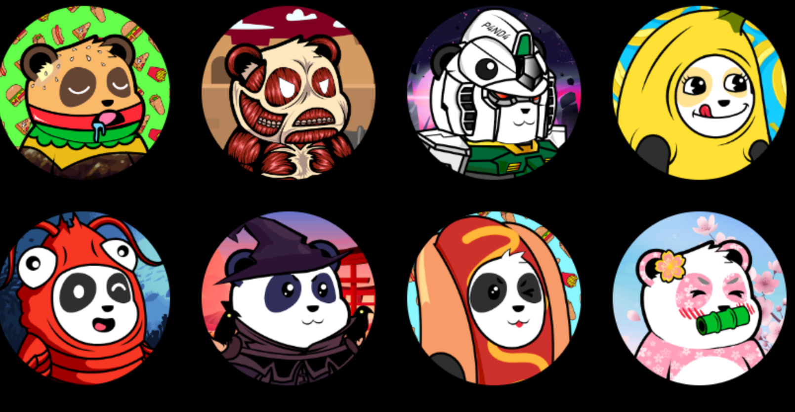

熊猫乐园是 8,888 个独特的、随机生成的熊猫人形机器人的集合，它们作为 ERC-721 NFT 在以太坊区块链上冒险。

每个熊猫乐园 NFT 都是独一无二的，并通过 180 多种可能的属性和特征（如背景、皮肤、衣服、面部表情、配饰和头饰）以编程方式生成。

我们的 Panda 社区获得了蓝筹 nfts，以将它们作为在游戏中与我们一起冒险和成长的角色，并在其他 Metaverse 平台上建立我们的足迹

$BAMBOO 代币将代表我们的游戏币。每个熊猫乐园 NFT 每天可以通过 Staking 赚取 100 $BAMBOO

