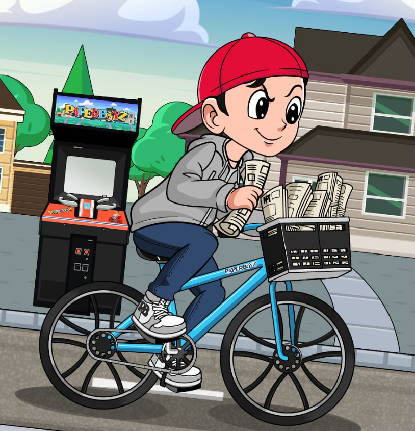

NFTMagazine.com 打造的旗舰系列。Paper Boyz 持有者可以终生访问 NFTMagazine.com Premium Discord 和 2022 年冬季 NFTMagCon 的门票。

除了这些福利之外，Paper Boyz持有者将获得 NFTMagazine Alpha 社区不和谐组的终身访问权，每年价值 1,200 美元！

Paper Boyz 将在年底前在迈阿密举办NFTMag 会议所有 Paper Boyz 持有者都将获得一张可免费转售的 IRL 门票，以参加该活动，这是该领域今年最大的会议之一。可供非持有人出售的门票数量有限，这些门票的价值为 2,450 美元。

