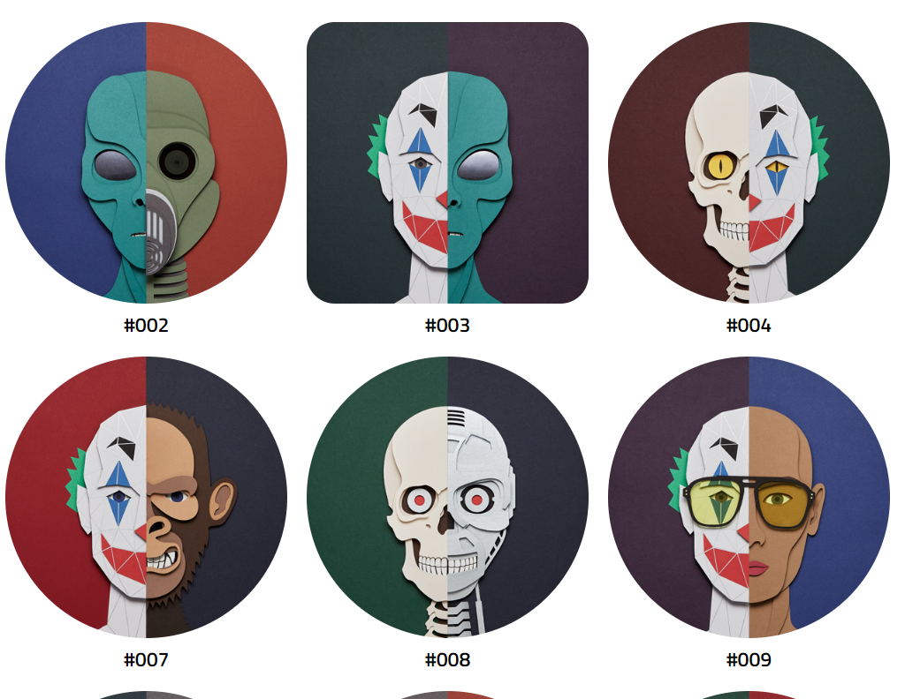

双 / 手工制作 / 艺术家生成 / 真正有限的混合 NFT 项目
以艺术家为中心，在这种情况下是一位纸艺艺术家，这个项目是对生成 PFP 项目成功的致敬
目前是一个人的乐队，绝对没有办法制作数千个，因为每个作品都需要手动交互、视频录制和最后的清理，因此这个项目的稀缺性在本质上是有保证的
100 件仅在创世纪掉落，沿途可能是少数荣誉的
第一批支持者和持有者将积极参与并成为这个小项目未来的决策者
可选择实施实体件，尽管这取决于项目的受欢迎程度

