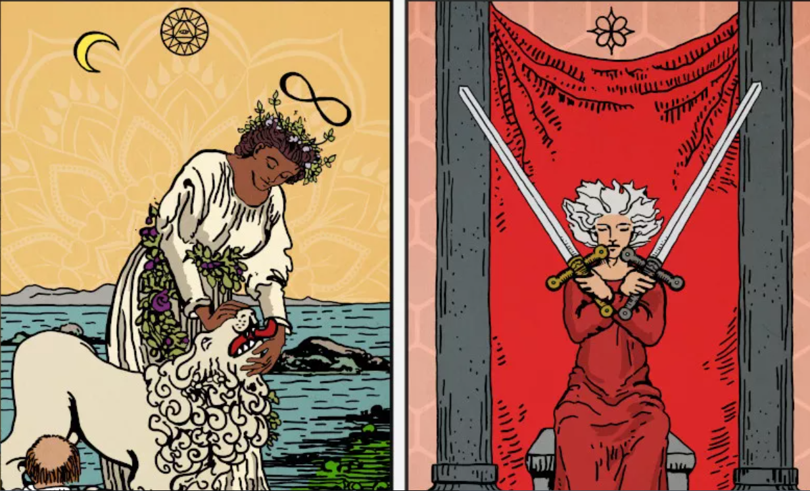

2021 年 9 月 13 日 - 寓言 NFT 揭示
收集手绘的数字艺术作品并发现它们隐藏的秘密。
在以太坊区块链上为您的 Parables 赋予唯一名称。
参加隐藏在图像中的 7 次寻宝活动.....一种新型的集体艺术项目

独自坐在大理石宝座上的皇帝，凝视着远方。 
那个快乐的傻瓜，永远迷失在过去快乐的回忆中。 
灰角恶魔，统治着他的追随者。 
欢迎来到寓言的世界。 
受经典和标志性的塔罗牌图像的启发，Parable 提供了一种新鲜、更丰富多彩、更具包容性的既定主题。每个寓言都是独一无二的，充满了神秘和意义。 

