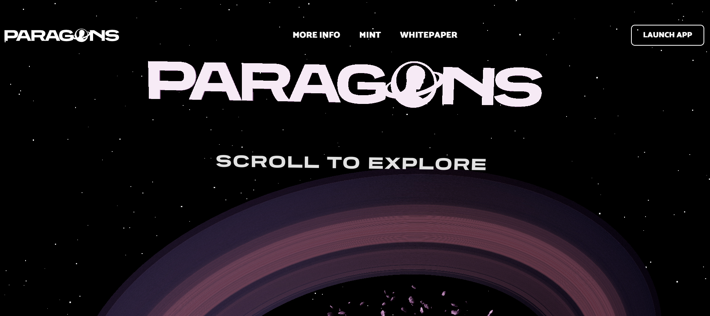

作为第 1 阶段版本的一部分，初始铸造 3424 个 Paragon。所有持有者都可以为每个 Paragon 铸造免费的遗物。根据 Paragon 的令牌 ID，遗物将具有更多实用性。所有持有者都将能够铸造一个免费的 Shrine NFT，这将每天在他们的土地上产生他们可以收获的资源。风景将给予所有 Paragon 持有者。持有者可以在浏览器中访问和探索它。景观将反映他们典范的审美。ERC-20 代币将发布给持有者。所有持有者现在都可以将他们收集的资源转换为代币。有限数量的 Parables 将有机会使用资源持有者收集的资源和他们收集的代币进行铸造。持有者将能够通过抵押他们的 NFT 来被动地赚取代币。Paragons 和 Parables 可以被质押。持有者将能够前往 Paragon 的其他景观以交易资源或只是闲逛。团队将继续为 Paraverse 以及未来的掉落、资源和代币功能增加价值。

