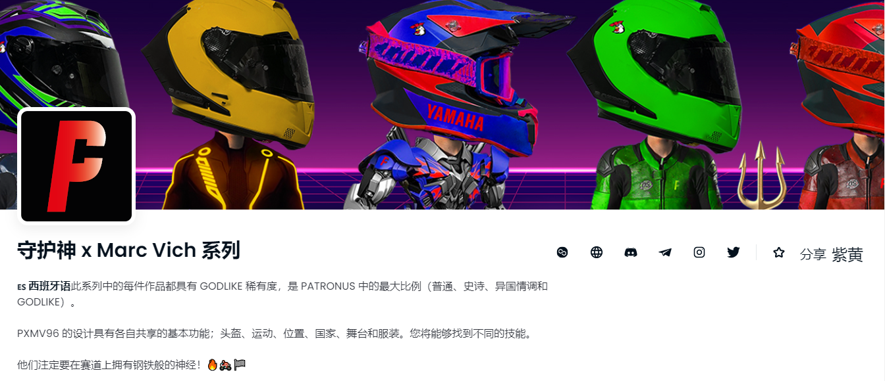

PXMV96 的设计具有各自共享的基本功能；头盔、运动、位置、国家、舞台和服装。您将能够找到不同的技能。

他们注定要在赛道上拥有钢铁般的神经！

🇬🇧 英语此系列中的每件作品都具有 GODLIKE 稀有度，是 PATRONUS 中的最大比例（普通、史诗、异国情调和 GODLIKE）。

PXMV96 的设计具有彼此共享的基本功能；头盔、运动、位置、国家、舞台和西装。您将能够找到不同的能力。

他们注定要在赛道上拥有钢铁般的神经！

