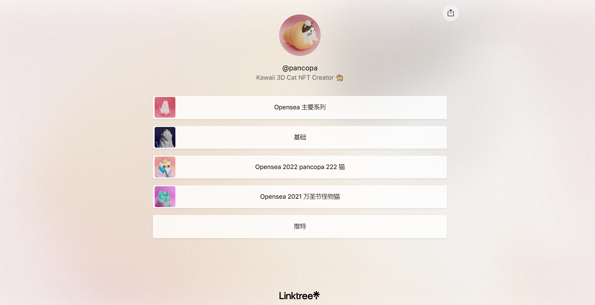

▶ 什么是 Pancopa 222 猫？
Pancopa 222 Cats 是一个 NFT（不可替代令牌）集合。存储在区块链上的数字艺术品集合。
▶ 有多少 Pancopa 222 Cats 代币？
总共有 77 个 Pancopa 222 Cats NFT。目前，54 位车主的钱包中至少有一个 Pancopa 222 Cats NTF。
▶ 最昂贵的 Pancopa 222 Cats 销售是什么？
售出的最昂贵的 Pancopa 222 Cats NFT 是 #69。它于 2022-06-06（3 个月前）以 181.4 美元的价格售出。
▶ 最近卖出了多少 Pancopa 222 Cats？
过去 30 天内售出了 2 个 Pancopa 222 Cats NFT。

