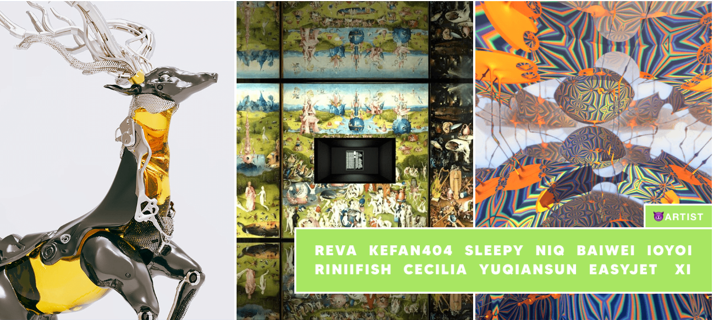

Panda Blocks 是以太坊区块链上 2048 个 NFT 收藏品的集合。每个 NFT 都是由全球 23 位知名艺术家提交的艺术品片段的独特组合。类似拼图的组合可以是 3x3、2x2，以及显示单个完整艺术品的最稀有的 1x1。

该项目由 WeirDAO 发起，与 Crypto Art Panda 社区合作

WeirDAO 是一个由独立加密艺术家组成的去中心化自治组织，是所有加密朋克艺术家的方舟。WeirDAO旨在促进加密艺术家之间以及加密艺术家与项目之间的交流、相互支持和协作，弘扬艺术朋克，捍卫艺术的纯粹性和独立性。

