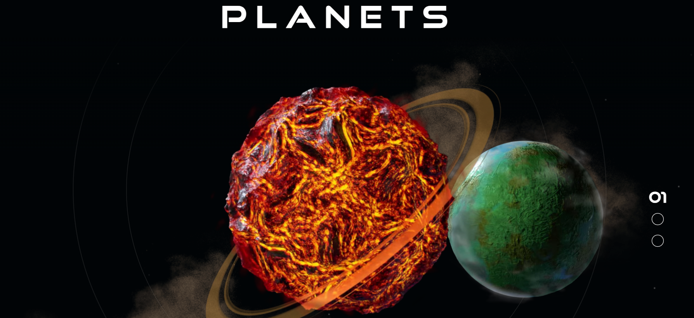

 人类对其他星球上的生命着迷，许多人竞相在外太空定居。Charged Particles在新的Particlon宇宙中直接为您带来了这个机会。Charged Particles 允许个人将其他资产嵌套在他们的 NFT 中，从而使 NFT 在效用方面打开了闸门。

Particlons 提供了您在加密空间中其他任何地方都找不到的功能，并构建了可用于游戏的区块链资产以参加奖池锦标赛。
Particlons 是铸造时第一个带有嵌套ERC-20 实用程序令牌的生成下降。每个 Particlon 将拥有唯一数量的 Particlon 实用代币 ($PUT)，可用于获取额外的游戏内资产和进入代币门控锦标赛。早期铸币者将获得更多 $PUT 代币奖励。

