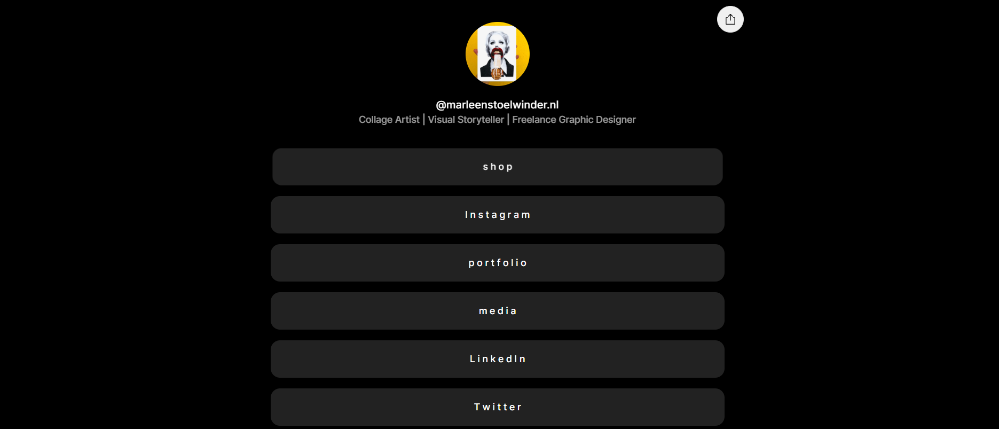

谁将在视觉传达领域推销您的产品或服务。能概念化思考，敢于尝试，做商业翻译。

您可以联系我进行设计；名片、出生公告、活动图片寻找可识别和令人惊讶之间的界限。我喜欢结构，在其他人停止的地方处理和继续。

独特的想法，我有时会眨眨眼，寻找可识别和令人惊讶之间的界限。我喜欢结构，在其他人停止的地方处理和继续。

有趣、调皮、误导和意外：这些是 Marleen Stoelwinder 的拼贴画。我想用我的拼贴画来娱乐和激发好奇心。例如，我使用正常的东西并以不寻常的方式使用物体和形状，以创造一个新的和意想不到的图像。

我使用我遇到的现有图像。这就是我的拼贴画的巧合。我所有的拼贴画都是手工制作的，限量版印刷和签名。

