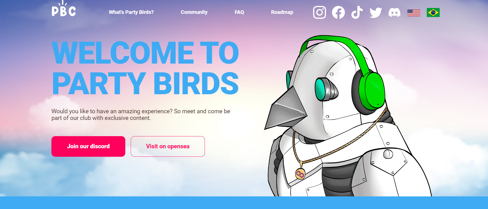

Party Birds 包含 10,000 多张独特的鸟类图片，每张图片都有自己的个性和风格，随时准备参加派对。这些鸟生活在等待被采用的区块链上，所有这些都已经透露给你，你可以在 Open Sea 上以 0.008 ETH 的价格免费获得你的鸟。

你的旅程从获得一只派对鸟开始。有了它，您就可以独家访问我们的俱乐部，除了为下一个做出贡献外，我们还将把 15% 的利润捐赠给您推荐和选择的机构，我们将帮助我们另外 5% 的收益项目社区本身，除了能够在塑造项目的发展和轨迹方面发挥独特作用的能力之外，这就是为什么我们的主要目标是围绕“我们可以为社区带来多少价值？”这个问题而建立的。

