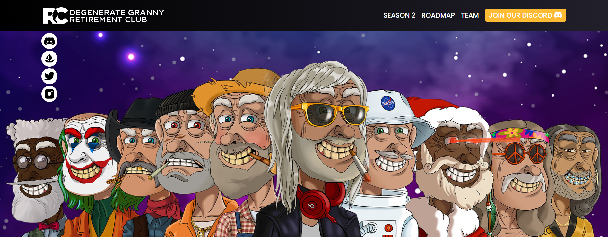

派对爷爷是 10,000 位爷爷的独家收藏。它们作为 ERC-721 代币存储在以太坊区块链上并托管在 IPFS 上。

拥有超过 180 种手工设计的特质，每位爷爷都是独一无二的，并拥有退休俱乐部的会员资格。爷爷希望所有的持有者都能和他们一起享受生活。所以找到适合你的爷爷，就有机会赢得20万美元一起退休！

2077年，猿类入侵元界。最后的 10,000 人决定在那里建立一个俱乐部，分享这个曾经庆祝生命的世界的记忆。所有会员都将享有各种福利，例如每月利息和参加独家活动。和我们一起退休。

