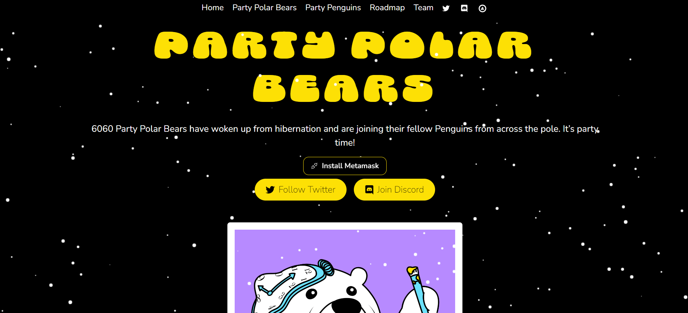

在 VIP 预售和一般销售期间，铸造一只派对北极熊只需 0.0606 ETH。

您每持有 2 只派对企鹅，您就可以领取 1 只免费派对北极熊，并且您的所有符合条件的索赔都可以通过单次交易执行。例如，如果您持有 100 只派对企鹅，那么您有资格获得的所有 50 只派对北极熊都可以一次性领取。

每笔交易最多可以铸造 20 只派对北极熊。但是，如果您真的想成为派对的生命，您可以执行任意数量的交易。

总共 6060 个池，其中多达 3030 个将作为可免费领取的派对北极熊回到派对企鹅社区。我们还为新的社区成员留出空间来享受乐趣！

