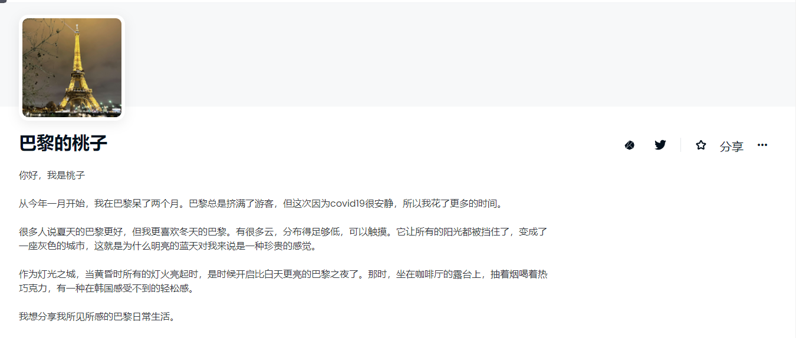

很多人说夏天的巴黎更好，但我更喜欢冬天的巴黎。有很多云，分布得足够低，可以触摸。它让所有的阳光都被挡住了，变成了一座灰色的城市，这就是为什么明亮的蓝天对我来说是一种珍贵的感觉。作为灯光之城，当黄昏时所有的灯火亮起时，是时候开启比白天更亮的巴黎之夜了。那时，坐在咖啡厅的露台上，抽着烟喝着热巧克力，有一种在韩国感受不到的轻松感。我想分享我所见所感的巴黎日常生活。感受巴黎的冬天、颜色、气味和情感。谢谢你。-xoxo，桃子

