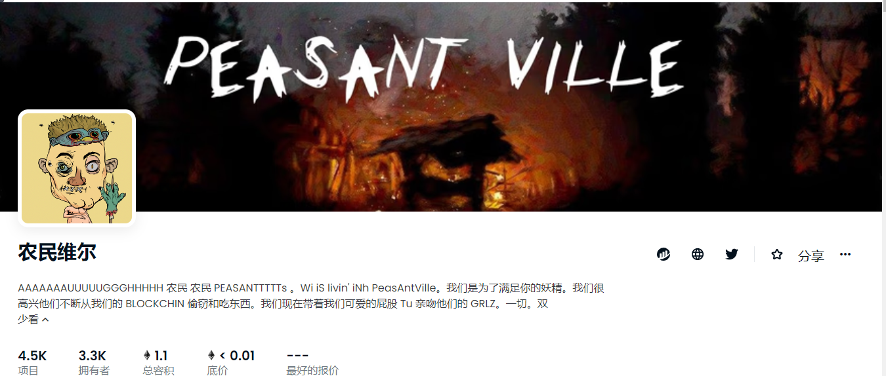

##### ▶ 什么是农民村？

Peasantville 是一个 NFT（不可替代代币）集合。存储在区块链上的数字艺术品集合。

##### ▶ 有多少 Peasantville 代币？

总共有 4,495 个 Peasantville NFT。目前，3,262 名业主的钱包中至少有一个 Peasantville NTF。

##### ▶ 最昂贵的 Peasantville 销售是什么？

售出的最昂贵的 Peasantville NFT 是 [Peasantville #3069](https://www.nft-stats.com/asset/0xd376e16ac4d2160541048e08eb95001b6b8f1a68/3069)。它于 2022 年 6 月 22 日（2 个月前）以 104.3 美元的价格售出。

##### ▶ 最近卖出了多少 Peasantville？

过去 30 天内售出了 119 个 Peasantville NFT。

##### ▶ Peasantville 的费用是多少？

在过去 30 天里，Peasantville NFT 最便宜的销售额低于 2 美元，最高销售额超过 16 美元。Peasantville NFT 在过去 30 天内的中位价格为 5 美元。

