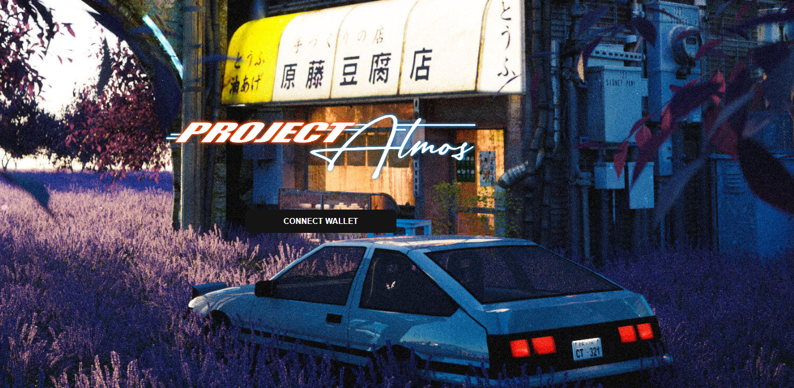

PA:SYI_ 是 Project Atmos 元宇宙探索身份概念的 10,000 PFP 扩展。

PFP 在我们的社会中发挥着主导作用。它告诉世界我们喜欢什么，不喜欢什么，并定义了我们是谁以及我们渴望成为谁。PFP 是我们的在线身份。

PA:SYI_ 是对个人与其在线角色之间这种联系的探索。我们着手探索这些错综复杂的事物，但我们没有使用可识别的面孔和可识别的特征（3D 眼镜，任何金色的东西），而是使用以更自然的方式代表感受和兴趣的元素。初升的太阳，朦胧的黄昏，一条孤独的路；结合起来，这些元素成为你的故事，你的身份。

