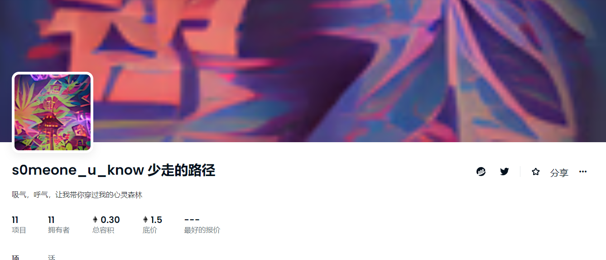

##### ▶ s0meone_u_know 少走过的路径是什么？

s0meone_u_know 少走的路径是一个 NFT（不可替代令牌）集合。存储在区块链上的数字艺术品集合。

##### ▶ s0meone_u_know 代币走过的路径少了多少？

s0meone_u_know NFT 总共少走了 11 条路径。目前，11 位所有者的钱包中至少少了一条 s0meone_u_know NTF 走过的路径。

##### ▶ s0meone_u_know 促销中少走的最昂贵的路径是什么？

s0meone_u_know NFT 出售的最昂贵的 Path less traveled 是 [Path less traveled #1](https://www.nft-stats.com/asset/0xad684d16174c9713db42156b95dc59f98eab34b5/0)。它于 2022-07-04（大约 2 个月前）以 329.3 美元的价格售出。

##### ▶ 最近售出了多少 s0meone_u_know 少走的 Path？

在过去 30 天内售出的 s0meone_u_know NFT 所经过的路径减少了 1 条。

