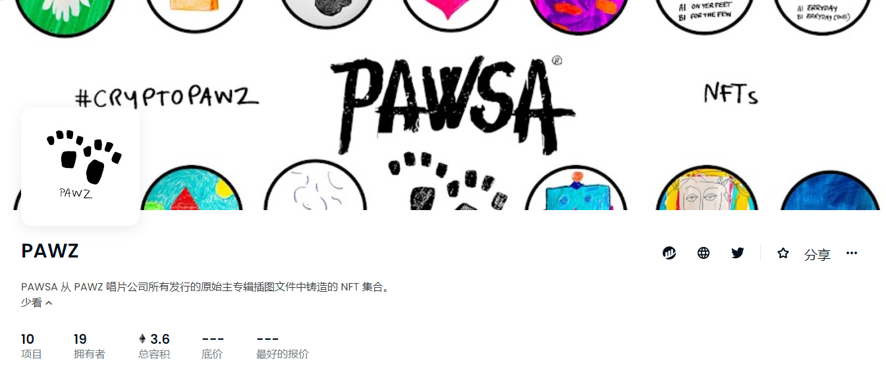

##### ▶ 什么是 PawZees 俱乐部？

PawZees Club 是一个 NFT（非同质代币）集合。存储在区块链上的数字艺术品集合。

##### ▶ 存在多少 PawZees Club 代币？

总共有 1,467 个 PawZees Club NFT。目前，252 位车主的钱包中至少有一个 PawZees Club NTF。

##### ▶ 最近卖出了多少 PawZees Club？

过去 30 天内售出 0 个 PawZees Club NFT。

