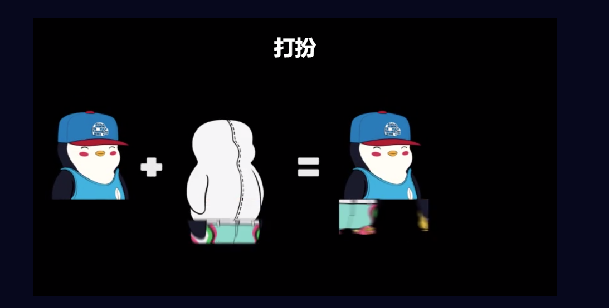

企鹅是怎么穿衣服的？

第 1 步：铸造您的底部（每笔交易您最多可以铸造 10 个，包括您拥有的每个 Pengu 对应的 1 个底部）

第2步：把它带到更衣室！在合并上衣和铸造的下装之前预览您的全尺寸 Pengu。（当你将顶部与底部合并时，整个企鹅的皮肤和背景会自动匹配！）

第 3 步：没有你我会摇摇晃晃吗？并非所有裤子都合身，因此您可以在 Opensea 上进行交易或寻找不同的设计来合并。

第 4 步：你是企鹅吗？上衣太多或下衣太多？混合搭配组合或为您的朋友创建企鹅军队

将有 8,500 个 Penguin Bottoms，每个花费 0.05 ETH。所以不是所有的企鹅都会和他们的屁股团聚！早期的支持者将能够铸造更多的底部！

